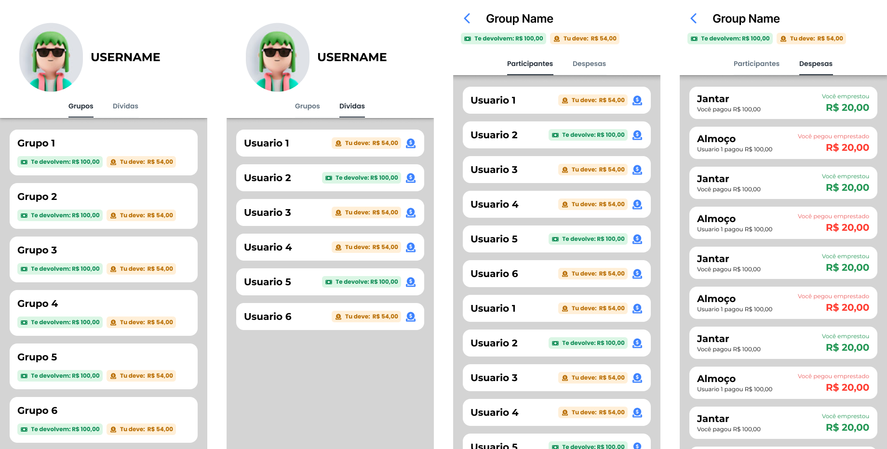

# Split&Conquer

Projeto desenvolvido como trabalho final para a disciplina INF01120 - Técnicas de Construção de Programas do Instituto de Informática da Universidade Federal do Rio Grande do Sul (UFRGS), no período letivo de 2024/2.

## Equipe

- Gabriel Perini
- Paulo Henrique Ceccato
- Pedro Bavaresco
- Rafael Petry

## Sobre o Projeto

**Split&Conquer** é uma aplicação de gerenciamento de despesas em grupo, inspirada na funcionalidade do Splitwise. O objetivo é facilitar o controle e a divisão de despesas entre amigos, familiares ou colegas de trabalho, proporcionando uma visão clara de quem deve quanto a quem.

### Funcionalidades

- **Criação de Grupos**: Permite criar grupos de pessoas para organizar as despesas de forma colaborativa.
- **Registro de Despesas**: Permite registrar e categorizar despesas, associando-as a um ou mais membros do grupo.
- **Divisão Automática de Valores**: A aplicação calcula automaticamente o valor que cada membro deve pagar ou receber, com base nas despesas cadastradas.

### Estrutura do Repositório

- **/src**: Contém o código-fonte da aplicação.
- **/pdf**: Documentação em PDF referente ao projeto.
- **/uml**: Diagramas UML que detalham a arquitetura do sistema e o fluxo de dados.
- **assets/**: Assets que precisamos para desenvolver a aplicação.
- **README.md**: Este arquivo.

## Layout

Para visualizar o design da interface da aplicação, acesse o link do Figma abaixo:

[Figma - Split&Conquer](https://www.figma.com/design/T6TM41iFMKwij7gMAP0kdr/Trabalho-de-TCP?node-id=0-1&node-type=canvas&t=K276aUyXKQGyv7zL-0)

### Pré-visualização



## Como Executar o Projeto

1. Clone o repositório:
   ```bash
   git clone https://github.com/RafaelPetr/INF01120_Grupo2.git

## API

### Pacotes

- **com.splitandconquer.api.ApiApplication**: Classe main que inicializa a API.
- **com.splitandconquer.api.controllers**: Controladores que fazem o roteamento das consultas.
- **com.splitandconquer.api.models**: Classes que modelam as entidades envolvidas nas operações das consultas.
- **com.splitandconquer.api.payloads**: "Moldes" para receber valores de POST.
- **com.splitandconquer.api.responses**: "Moldes" de resposta às consultas.
- **com.splitandconquer.api.views**: Define interfaces para serem utilizadas como notação para selecionar os atributos dos models a serem retornados como JSON em consultas.

### Pré-requisitos para Rodar Localmente

- Java 17 (JDK e JRE)
- Netbeans 23

### Como Rodar Localmente

Abra o diretório **api** como um projeto dentro do Netbeans. Dentro do projeto, faça o build, abra o arquivo **ApiApplication.java** e execute ele (Shift + F6). Verifique a porta definida pelo Tomcat no output do console (costuma ser 8080), pois ela será usada para realizar as consultas no localhost. Utilize algum software para testar as consultas da API (como Postman). 

Exemplo de consulta: http://localhost:8080/groups

___

### GET /groups
Retorna todos grupos cadastrados com o seu id, título, dívida do usuário logado e dividendo do usuário logado.

**Resposta**

```
{
    success: boolean,
    content: {
        id: int,
        title: String,
        debt: float,
        dividend: float,
    }[]
}
```
___

### GET /users
Retorna todos usuários cadastrados com seu id, nome e dívida com o usuário logado.

**Resposta**

```
{
    success: boolean,
    content: {
        id: int,
        name: String,
        debt: float,
    }[]
}
```
___

### GET /groups/:id
Retorna o grupo com o id informado, devolvendo seu id, título, dívida com o usuário logado, dividendo com o usuário logado e seus membros (com informações de id, nome e dívida com o usuário logado).

**Parâmetros**

|          Nome | Obrigatório |  Tipo   | Descrição                                                                                                                                                         |
| -------------:|:--------:|:-------:| ------------------------------------------------------------------------------------------------------------------------------------------------------------------- |
|     `:id` | obrigatório | int  | O id do grupo                                                                   |

**Resposta**

```
{
    success: true,
    content: {
        id: int,
        title: String,
        debt: float,
        dividend: float,
        members: {
            id: int,
            name: String,
            debt: float,
        }[]
    }
}
```

___

### GET /groups/:id/expenses
Retorna todas despesas de um grupo informado.

**Parâmetros**

|          Nome | Obrigatório |  Tipo   | Descrição                                                                                                                                                         |
| -------------:|:--------:|:-------:| ------------------------------------------------------------------------------------------------------------------------------------------------------------------- |
|     `:id` | obrigatório | int  | O id do grupo                                                                   |

**Resposta**

```
{
    success: boolean,
    content: {
            id: int,
            title: String,
            amount: float,
            payer: {
                id: int,
                name: String
            },
            participants: {
                id: int,
                name: String
            }[],
        }
     }[]
}
```

___

### GET /groups/:groupId/expenses/:expenseId
Retorna a despesa informada de um dado grupo.

**Parâmetros**

|          Nome | Obrigatório |  Tipo   | Descrição                                                                                                                                                         |
| -------------:|:--------:|:-------:| ------------------------------------------------------------------------------------------------------------------------------------------------------------------- |
|     `:groupId` | obrigatório | int  | O id do grupo                                                                   |
|     `:expenseId` | obrigatório | int  | O id da despesa                                                                   |

**Resposta**

```
{
    success: boolean,
    content: {
            id: int,
            title: String,
            amount: float,
            payer: {
                id: int,
                name: String
            },
            participants: {
                id: int,
                name: String
            }[],
        }
     }
}
```

___

### POST /create-expense
Cria uma nova despesa de grupo.

**Payload**

```
{
    title: String,
    amount: float,
    participants: int[],
    payerId: int,
    groupId: int,
}
```

**Resposta**

```
{
    success: boolean,
    message: String
}
```

___

### POST /create-payment
Realiza um pagamento de um usuário para outro.

**Payload**

```
{
    payerId: int,
    receiverId: int,
    amount: float,
    groupId: int,
}
```

**Resposta**

```
{
    success: boolean,
    message: String
}
```

___
